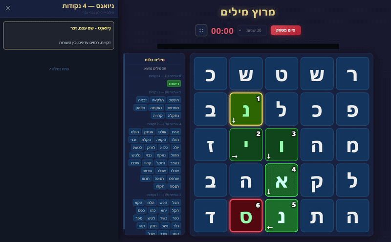

# מרוץ מילים — Boggle בעברית

🎮 **[שחק עכשיו](https://hebboggle.onrender.com)**

---

## המשחק

- לוח Boggle עברי של 5×5
- טיימר עם בחירת אורך משחק
- פס התקדמות הזמן
- צליל + פופאפ בסיום הזמן
- מצב מסך מלא

---

## מילים

- המשחק מציג את כל המילים האפשריות על הלוח בסיום המשחק
- אפשרות חיפוש מילה באמצעות גרירה ידנית על האותיות בלוח
- חלונית הצגת תוצאות המילים מתוך אתר "מילוג"
- כפתור "פתח במילוג" לפתיחה בדפדפן

---

## עיצוב

- אנימציות כניסה לאותיות בתחילת משחק
- פס התקדמות לטיימר עם אפקט אזהרה ב-10 שניות האחרונות
- כאשר לוחצים על מילה, המסלול שלה מוצג על הלוח — התאים מוארים עם אנימציית זרימה וחיצי כיוון. אם למילה יש מספר מסלולים אפשריים — כולם מוצגים בו זמנית.

---

## מערכת הקוביות

המשחק משתמש במערכת קוביות מבוססת על בוגל האנגלי המקורי (5×5 = 25 קוביות).
כל קובייה מכילה 6 אותיות, ובכל משחק הקוביות מעורבבות באקראי ומוטלות — בדיוק כמו בגרסה הפיזית.

התפלגות האותיות על פני 150 הפאות (25×6) נקבעה לפי תדירות האותיות בשפה העברית:
- אותיות נפוצות כמו י׳, ש׳, ו׳, ל׳, מ׳, ה׳ מופיעות על פאות רבות ומובטחות כמעט בכל משחק
- אותיות נדירות כמו ג׳, ז׳, ט׳, ק׳, צ׳ מופיעות על פאות בודדות בלבד

כמו בבוגל המקורי — 5 קוביות עשירות בתנועות (א׳, ה׳, ו׳, י׳) מבטיחות שכל לוח יהיה ניתן למשחק.

---

## מאגר המילים

מאגר המילים נלקח מהריפו [eyaler/hebrew_wordlists](https://github.com/eyaler/hebrew_wordlists) — ספציפית מהקובץ `cc100_intersect_no_fatverb.csv`, שמכיל מילים נפוצות מהאינטרנט בשילוב עם מילון hspell, ממוין לפי תדירות שימוש.

על המאגר המקורי הורץ סקריפט פילטור שהסיר כ-40,000 מילים לא רלוונטיות:

- **ה׳ הידיעה** — מילים כגון "הכדור"
- **סמיכות** — מילים כגון "מסיבת"
- **שמות פרטיים** — נטענה רשימת שמות ישראליים נפוצים, ורק שמות שלא הופיעו גם ברשימת המילים הכללית הוסרו. שמות כמו "אור" ו"תמר" שיש להם משמעות עצמאית נשמרו, בעוד שמות ללא משמעות נוספת הוסרו
- **בכל"מ** — הסקריפט בדק כל מילה שמתחילה באחת מאותיות בכל"מ: אם גרסתה ללא האות הראשונה קיימת במאגר כמילה עצמאית, האות סווגה כקידומת והמילה הוסרה. אם לא — האות נחשבת חלק מהמילה עצמה ונשמרה. למשל "ממחר" הוסרה כי "מחר" קיימת, אבל "מלח" נשמרה כי "לח" אינה המילה הבסיסית שלה.

נשארו **146,792 מילים** נקיות.

בנוסף, מכיוון שבמשחק אין אותיות סופיות — לכל מילה שמסתיימת באות סופית (ך׳, ם׳, ן׳, ף׳, ץ׳) נוספה גם גרסה עם האות הלא-סופית המקבילה, כך שהמשחק מזהה למשל את "ערכ" כמילה תקינה.

